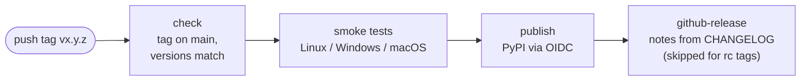

# Releasing guide for convolinear

**This guide acts as a checklist for me when releasing and shows what steps I take to make sure releases go smoothly.**

A release is driven by a tag. The tag must point at a commit already on `main`; a tag on a commit that isn't on `main` fails the workflow.

Everything in the PyPi release is automated after step 5 by `.github/workflows/release.yml`, the conda-forge release requires merging the auto-generated PR on the conda-forge feedstock.

## Release pipeline



## Design decisions

- **Why Trusted Publishing (OIDC):** so there is no stored API token to leak.
- **Why the smoke-tested files are the published files:** `publish` uploads the wheel and sdist the Linux smoke job built and tested, rather than rebuilding them, so what reaches PyPI is exactly what passed.
- **Why the tag must be on main:** a tag pushed on a feature-branch commit by mistake fails the `check` job before anything is built or published.
- **Why the tag is checked against both version strings:** the tag, `pyproject.toml` and `__version__` must agree, or the release would publish a version that doesn't match its tag. The check runs first, so a mismatch fails in seconds.
- **Why there's a three-OS matrix for a pure-Python wheel:** the dependencies and soundfile's native library aren't pure Python.
- **Why release notes come from the CHANGELOG:** so there is one source of truth.


## Normal release

1. Make sure `main` is green and the working tree is clean.
2. Bump the version in `pyproject.toml` and `convolinear/__init__.py`. They must match the tag.
3. Add the release section to `CHANGELOG.md`. The `## [x.y.z]` heading must match the tag with the `v` stripped, otherwise the automated release notes come out empty and the workflow fails.
4. Run the distribution smoke test locally: `uv run --no-project --python 3.13 scripts/smoke_test_dist.py`, then `shx rm -rf dist` (`shx` needed because I use Windows).
5. Push the git tag:
   ```bash
   git tag -a vx.y.z -m "vx.y.z"
   git push origin main --follow-tags
   ```
6. Watch the Release workflow. It first checks the tag is on `main` and matches the declared version. The smoke test then runs on three operating systems, the wheel and sdist the Linux smoke job tested are published to PyPI, and a GitHub Release is created from the changelog section.

   >If the publish step fails, nothing has been uploaded. If the cause is a setting outside the repository (for example, a Trusted Publishing misconfiguration on PyPI), fix it and use **Re-run failed jobs**; the tested artifacts are reused, so there is no need to re-tag or rebuild. If the fix needs a code or metadata change, delete the tag, commit the fix, and tag again.

7. Check <https://pypi.org/project/convolinear/> renders the README, including the hero image.
8. The conda-forge bot opens a PR against <https://github.com/conda-forge/convolinear-feedstock>. Check the dependency pins against `pyproject.toml`, then merge it.


## Dry run with a release candidate

> Do this any time the packaging metadata changes.

It exercises the entire publishing path (three-OS smoke test, Trusted Publishing, PyPI's server-side metadata validation) against the real PyPI, which is the only thing that proves the publisher is configured correctly (publishing a release candidate to TestPyPi doesn't).

1. Set the version in `pyproject.toml` and `convolinear/__init__.py` to `x.y.zrcN`.
2. Commit, then `git tag -a vx.y.zrcN -m "vx.y.zrcN"` and `git push origin main --follow-tags`.
3. The Release workflow runs. The `github-release` job is skipped by design for `rc` tags; smoke and publish must both be green.
4. Check <https://pypi.org/project/convolinear/x.y.zrcN/> renders.
5. Set the version to `x.y.z` in both files, commit, and carry on with the "Normal release" workflow.

Notes:

- A pre-release is not served to users by default: `pip install convolinear` ignores it unless someone passes `--pre`.
- The version number `x.y.zrcN` is taken permanently because PyPI never allows reuse, even after deletion.
- The conda-forge autotick bot normally ignores pre-releases. If a feedstock PR does appear for the rc, close it.
