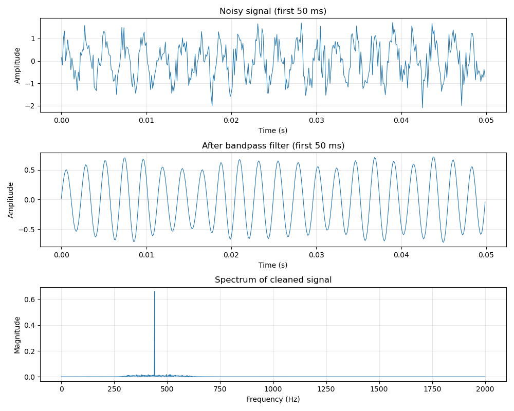

# convolinear

A clean, chainable Python library for digital signal processing.

`convolinear` wraps the power of NumPy and SciPy in a fluent, readable API. Common DSP tasks -
loading audio, filtering, mixing, and spectral analysis - become short, expressive one-liners
instead of 10+ lines of boilerplate.

Extract data from a `.wav` file, bandpass it, normalise it, take the Fourier transform, and plot
it - in a single line:

```python
Signal.from_wav("audio.wav").bandpass(300, 3000).normalize().fft().plot()
```

<p align="center">
  
</p>

## Install

**Core requirements:** Python 3.11+, NumPy >= 1.23.2, SciPy >= 1.9.2

**Optional dependencies** unlock the following loaders and features:

| Extra | Packages installed | Unlocks |
|-------|--------------------|---------|
| `plot` | matplotlib | every `.plot()` method |
| `audio` | soundfile | `Signal.from_audio()` |
| `pandas` | pandas, pyarrow | `from_csv()`, `from_parquet()`, `from_pandas()`, `to_dataframe()` |

MATLAB `.mat` files load through SciPy, already a core dependency - no extra needed.

### With pip

`convolinear` is published on [PyPi](https://pypi.org/project/convolinear):

```bash
pip install convolinear
```

```bash
pip install "convolinear[plot,audio,pandas]"
```

### With conda

`convolinear` is published on [conda-forge](https://anaconda.org/conda-forge/convolinear):

```bash
conda install -c conda-forge convolinear
```

conda-forge packages don't support pip-style extras - install the optional dependencies as
separate packages instead:

```bash
conda install -c conda-forge convolinear matplotlib soundfile pandas pyarrow
```

### With uv

```bash
uv add convolinear
```

```bash
uv add "convolinear[plot,audio,pandas]"
```

## Core concepts

### Immutability and chaining

Every transformation returns a **new** object; the original is never modified. A `Signal`'s sample
array is genuinely read-only, so branching from one source is always safe:

```python
raw = Signal.from_wav("recording.wav")

# Two independent processing paths from the same source
voice = raw.highpass(80).bandpass(300, 3400).normalize()
full = raw.lowpass(8000).normalize()
```

### The four types

| Type | Domain | Produced by |
|------|--------|-------------|
| [`Signal`](api/signal.md) | Time (samples x amplitude) | Constructors, transformations |
| [`Spectrum`](api/spectrum.md) | Frequency (Hz x complex coefficient) | `Signal.fft()` |
| [`PowerSpectrum`](api/power_spectrum.md) | Frequency (Hz x power density) | `Signal.psd()` |
| [`Spectrogram`](api/spectrogram.md) | Time-frequency (Hz x time x magnitude) | `Signal.spectrogram()` |

A `Spectrum` holds the raw complex FFT coefficients, so it inverts losslessly:
`sig.fft().to_signal()` returns `sig`. Magnitude, phase and power are derived views over those
coefficients.

Sample rates are floats, and rates below 1 Hz are fully supported - one sample per day is
`sample_rate=1/86400`.

## Where next

- [Quickstart](quickstart.md) - five worked snippets covering the common paths.
- [API Reference](api/signal.md) - every public method, generated from the source.
- [ECG: heart rate from raw samples](examples/ecg_heart_rate.ipynb) - the flagship walkthrough.
- [Daily data: finding slow cycles](examples/daily_cycles.md) - sub-1 Hz sample rates.
- [Benchmarks](examples/benchmarks.md) - measured convolution and filter throughput.
- [Changelog](https://github.com/sahmed0/convolinear/blob/main/CHANGELOG.md)
